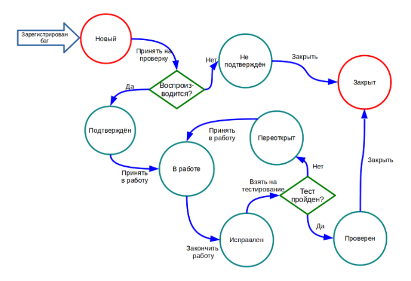
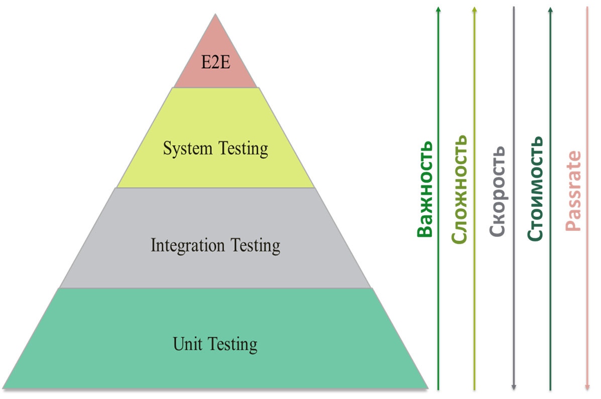

# QA

---

## Основные понятия
**Тестирование ПО** — это проверка соответствия между реальным и ожидаемым поведением программы, 
проводится на наборе тестов, который выбирается некоторым образом. 

**Чем занимаются в тестировании:**
* Планированием работ
* Проектированием тестов
* Выполнением тестирования
* Анализом результатов

**Основные цели тестирования:**
* **Техническая**: предоставление актуальной информации о состоянии продукта на данный момент.
* **Коммерческая**: повышение лояльности к компании и продукту, т.к. любой обнаруженный дефект негативно влияет на доверие пользователей.

### Баг
**Баг** — это несоответствие фактического результата выполнения программы ожидаемому результату.

#### Жизненный цикл бага

#### Серьезность (Severity) и приоритет (Priority)
**Серьезность (Severity)** — характеризует влияние дефекта на работоспособность приложения. Выставляется тестировщиком.

**Приоритет (Priority)** — указывает на очередность выполнения задачи или устранения дефекта. 
Чем выше приоритет, тем быстрее нужно исправлять дефект. Выставляется менеджером, тимлидом или заказчиком.

##### Градация Серьезности дефекта
**Blocker** - ошибка, приводящая приложение в нерабочее состояние, из-за которой дальнейшая работа с системой или 
ее ключевыми функциями становится невозможна, т.е. тестирование значительной части функциональности становится 
недоступно.

**Крит (Critical)** - неправильно работающая ключевая бизнес-логика, дыра в системе безопасности, проблема, 
приведшая к временному падению сервера или приводящая в нерабочее состояние некоторую часть системы, 
без возможности решения проблемы, используя другие непрямые пути (workaround).

**Значительный (Major)** - часть основной бизнес логики работает некорректно, есть возможность для работы с 
тестируемой функцией, используя обходные пути (workaround); либо дефект с высоким visibility – обычно не сильно влияющие 
на функциональность дефекты дизайна, которые, однако, сразу бросаются в глаза.

**Minor** - часто ошибки GUI, которые не влияют на функциональность, но портят юзабилити или внешний вид; 
либо незначительная функциональная ошибка, не нарушающая бизнес-логику тестируемой части приложения.

**Тривиальная (Trivial)** - ошибка, не касающаяся бизнес-логики приложения, не оказывающая никакого влияния на общее 
качество продукта, например, опечатки в тексте, несоответствие шрифта и оттенка и т.д.

---

## Пирамида тестирования

---

## Техники тест дизайна

### Эквивалентное Разделение
Это техника, при которой функционал (часто диапазон возможных вводимых значений) разделяется на группы эквивалентных по 
своему влиянию на систему значений. ПРИМЕР: есть диапазон допустимых значений от 1 до 10, 
выбирается одно верное значение внутри интервала (например, 5) и одно неверное значение вне интервала — 0.

### Анализ Граничных Значений
Это техника проверки поведения продукта на крайних (граничных) значениях входных данных. 
Если брать выше ПРИМЕР: в качестве значений для позитивного тестирования берется минимальная и максимальная 
границы (1 и 10), и значения больше и меньше границ (0 и 11). BVA может применяться к полям, записям, файлам, 
или к любого рода сущностям имеющим ограничения.

### Доменный анализ
Это техника основана на разбиении диапазона возможных значений переменной на поддиапазоны, 
с последующим выбором одного или нескольких значений из каждого домена для тестирования.

### Предугадывание ошибки
Это когда тестировщик использует свои знания системы и способность к интерпретации спецификации на предмет того, 
чтобы «предугадать» при каких входных условиях система может выдать ошибку.

### Причина-следствие
Подразумевается ввод условий, для получения ответа от системы (следствие).

### Сценарий использования
Use Case описывает сценарий взаимодействия двух и более участников (как правило — пользователя и системы).

### Исчерпывающее тестирование
Подразумевается проверка всех возможные комбинации входных значений. На практике не используется.

### Попарное тестирование
Это техника формирования наборов тестовых данных из полного набора входных данных в системе, 
которая позволяет существенно сократить общее количество тест-кейсов. 
Используется для тестирования, например, фильтров, сортировок.

### Тестирование на основе состояний и переходов
Применяется для фиксирования требований и описания дизайна приложения.

### Таблица принятия решений
Инструмент для упорядочения бизнес-требований, которые должны быть реализованы в продукте. 
Применяется для систем со сложной логикой. В таблицах решений представлен набор условий, 
одновременное выполнение которых приводит к определенному действию.
